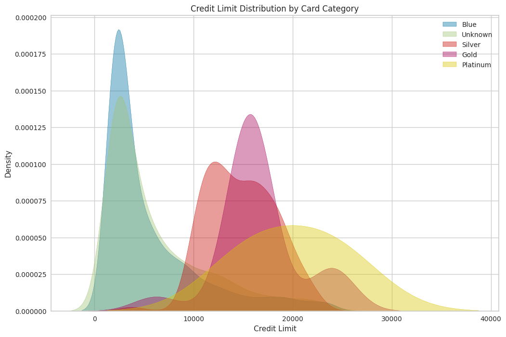
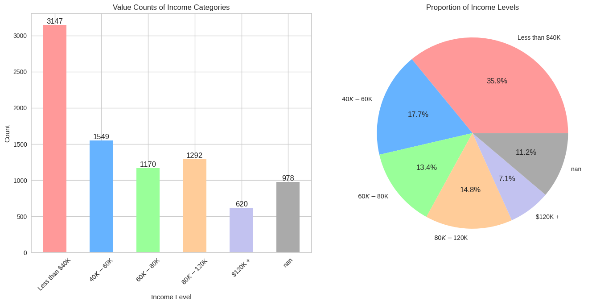
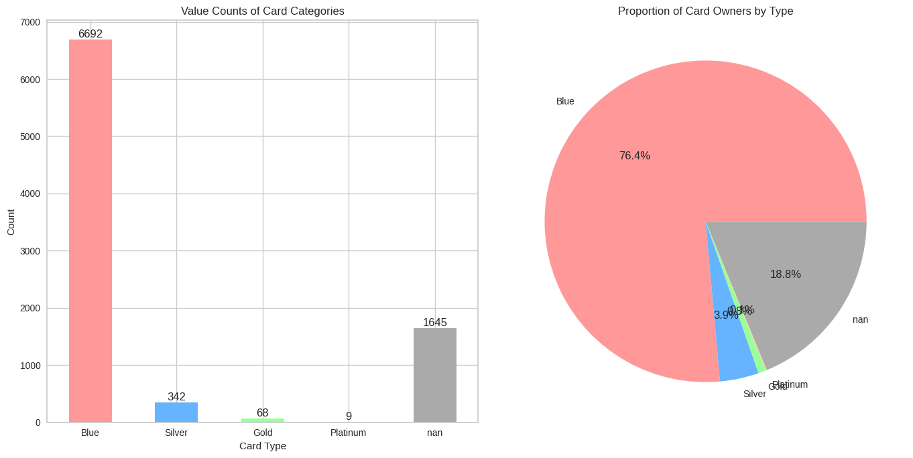
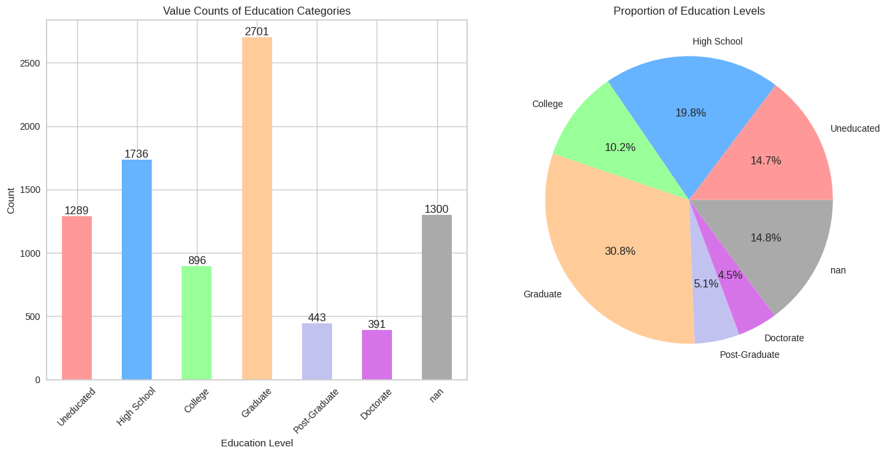

# Credit Limit Prediction using Machine Learning

This project focuses on predicting the **credit limit** of customers using various machine learning models. The dataset consists of customer demographic, financial, and behavioral attributes. The project follows a structured data preprocessing, exploratory data analysis (EDA), model selection, and evaluation approach.

## Table of Contents
- [Dataset](#dataset)
- [Data Preprocessing](#data-preprocessing)
- [Exploratory Data Analysis (EDA)](#exploratory-data-analysis-eda)
- [Model Training & Evaluation](#model-training--evaluation)
- [Results](#results)
- [Dependencies](#dependencies)

## Dataset
The dataset used in this project is [**CreditPrediction.csv**](./CreditPrediction.csv), which contains financial and demographic details of customers.

### Features:
| Column | Description |
|---------|------------|
| CLIENTNUM | Unique identifier for the customer |
| Customer_Age | Age of the customer in years |
| Gender | M (Male) / F (Female) |
| Dependent_count | Number of dependents the customer has |
| Education_Level | Customer's education level (e.g., High School, Graduate, Doctorate) |
| Marital_Status | Marital status of the customer (Married, Single, Divorced, Unknown) |
| Income_Category | Annual income category (e.g., Less than $40K, $40K-$60K, $60K-$80K, etc.) |
| Card_Category | Type of credit card (Blue, Silver, Gold, Platinum) |
| Months_on_book | Number of months the customer has been with the bank |
| Total_Relationship_Count | Total number of products held by the customer |
| Months_Inactive_12_mon | Number of months the customer has been inactive in the last 12 months |
| Contacts_Count_12_mon | Number of contacts made in the last 12 months |
| Credit_Limit | Credit limit assigned to the customer (Target Variable) |
| Total_Revolving_Bal | Total revolving balance on the credit card |
| Total_Amt_Chng_Q4_Q1 | Change in transaction amount (Q4 over Q1) |
| Total_Trans_Amt | Total transaction amount in the last 12 months |
| Total_Trans_Ct | Total transaction count in the last 12 months |
| Total_Ct_Chng_Q4_Q1 | Change in transaction count (Q4 over Q1) |
| Avg_Utilization_Ratio | Average card utilization ratio |
| Unnamed: 19 | Unused column removed from the dataset |

## Data Preprocessing
### Handling Missing Values
- **Unknown values replaced** with `NaN`.
- Columns like `CLIENTNUM` and `Unnamed: 19` were **dropped** as they were not useful.
- Missing values were handled using **mode imputation** for categorical data and **mean imputation** for numerical data.
- K-Nearest Neighbors (KNN) imputation was also explored.

```python
from sklearn.impute import KNNImputer
imputer = KNNImputer(n_neighbors=3)
df_imputed = pd.DataFrame(imputer.fit_transform(df), columns=df.columns)
```

### Handling Duplicates & Outliers
- Duplicate records were **removed**.
- Outliers were detected using **Interquartile Range (IQR)** and either removed or replaced.

## Exploratory Data Analysis (EDA)
- Distribution of Card Type against Credit Limits


- Income Category Distribution


- Card Type Distribution


- Education Level Distribution



## Model Training & Evaluation
We experimented with multiple regression models:
- **Linear Regression**
- **Ridge Regression**
- **Random Forest Regressor** (Best performing model)
- **Gradient Boosting**
- **K-Means Clustering + Random Forest**

```python
from sklearn.ensemble import RandomForestRegressor
model = RandomForestRegressor()
model.fit(X_train, y_train)
y_pred = model.predict(X_test)
```

## Results
| Model | Mean Squared Error (MSE) | R-squared (R²) |
|--------|-------------------------|----------------|
| Linear Regression | 33M | 0.60 |
| Random Forest | **10M** | **0.87** |
| KMeans + Random Forest | 11M | 0.84 |

## PyCaret Usage
[PyCaret](https://pycaret.org/) is an open-source, low-code machine learning library that automates model training and evaluation. It provides easy-to-use functions for feature selection, preprocessing, and hyperparameter tuning.

### PyCaret in Action
```python
from pycaret.regression import *
s = setup(df_imputed, target="Credit_Limit", session_id=123)
best = compare_models()
```


## Dependencies
- Python 3.8+
- Pandas
- NumPy
- Scikit-learn
- Matplotlib
- Seaborn
- PyCaret
